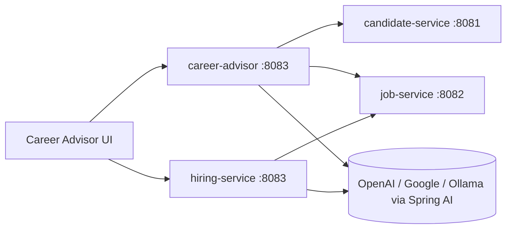

# AI-Operations-Platform

AI-Operations-Platform is a multi-module Spring Boot microservices system that matches candidates to jobs, compares opportunities with LLM support, generates tailored resumes, and manages job applications with async AI evaluation.

## Modules

- `candidate-service`: Candidate profile and skills data API
- `job-service`: Job catalog and skill-based discovery API
- `career-advisor`: LLM-powered recommendation, comparison, and resume generation API + web UI
- `hiring-service`: Job application intake and async AI scoring API

## Architecture

### High-Level Flow

1. `career-advisor` fetches candidate details from `candidate-service`.
2. `career-advisor` fetches relevant jobs from `job-service`.
3. `career-advisor` uses Spring AI `ChatClient` to:
	 - score candidate-job matches
	 - compare selected jobs
	 - generate tailored resumes
4. Candidate submits an application to `hiring-service`.
5. `hiring-service` publishes an event and asynchronously evaluates the submitted application with AI.
6. `hiring-service` stores and serves enriched application results.

### Service Interaction Diagram



### Technology Notes

- Java 21
- Spring Boot 3.3.0
- Spring AI BOM 1.0.0 (managed at root `pom.xml`)
- H2 database for local development
- Maven multi-module parent build

## Local Ports

- Candidate service: `8081`
- Job service: `8082`
- Career advisor: `8083`
- Hiring service: `8083` (currently same as career-advisor in `application.properties`; change one before running both simultaneously)

## Secrets and AI Profiles

- `career-advisor` imports secrets from:
	- `secrets.env` in module directory (optional)
	- `../secrets.env` at repo root (optional)
- AI profile is controlled via `spring.profiles.active` in service `application.properties`.

## Build and Run

### Build entire workspace

From repo root:

```bash
./candidate-service/mvnw -f pom.xml -DskipTests compile
```

### Run individual services

```bash
cd candidate-service && ./mvnw spring-boot:run
cd job-service && ./mvnw spring-boot:run
cd career-advisor && ./mvnw spring-boot:run
cd hiring-service && ./mvnw spring-boot:run
```

## Service Documentation

- `candidate-service/README.md`
- `job-service/README.md`
- `career-advisor/README.md`
- `hiring-service/README.md`